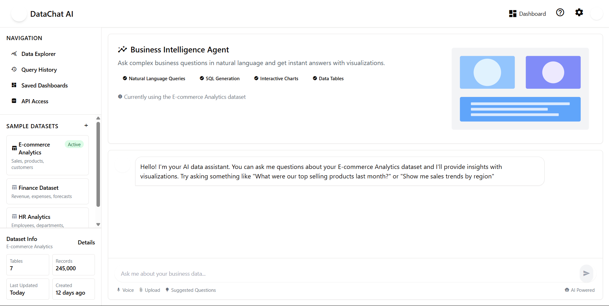
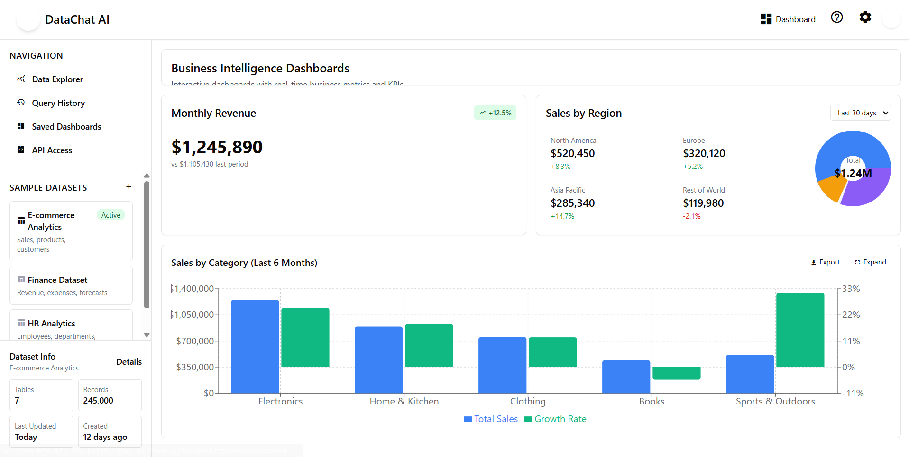
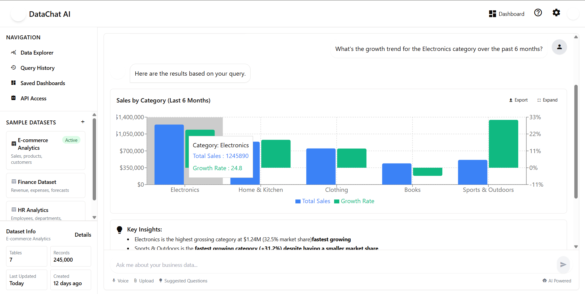
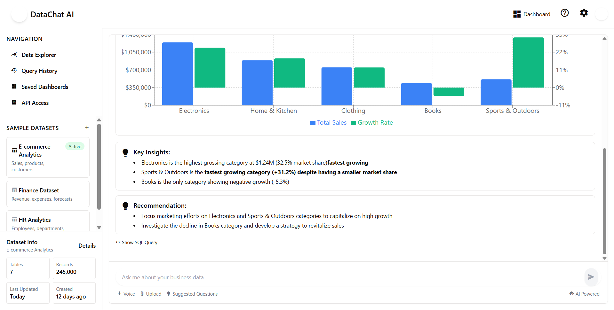

# AI Data Agent

An AI-powered conversational interface for answering complex business questions from a SQL database using natural language. The application provides rich visualizations and tabular summaries alongside responses.

---

## 🧠 Features

- 🔍 **Natural Language Query Interface**: Ask vague, analytical, or complex business questions.
- 📊 **Smart Visualizations**: Context-aware charts and tables rendered alongside answers.
- 🧹 **Handles Dirty Schema**: Works with messy column/table names and inconsistent data.
- 💬 **Chat UI**: Clean and interactive frontend for asking questions and viewing results.

---

## 🏗️ Architecture Overview

- **Frontend**: React + Vite + TailwindCSS  
  - `client/src/components/chat`: Main chat UI (`ChatContainer`, `QueryInput`, `ChatMessage`)  
  - `client/src/components/visualizations`: Charts and data tables  
  - `client/src/components/ui`: Reusable UI elements

- **Backend**: Node.js + Express  
  - `server/openai.ts`: Calls to LLM (e.g. GPT) for query parsing and answering  
  - `server/queryParser.ts`: Converts natural language to SQL  
  - `server/db.ts`: Executes SQL queries  
  - `server/routes.ts`: API endpoints

- **Shared Schema**:  
  - `shared/schema.ts`: Shared types between frontend/backend

- **Data Handling**:  
  - Handles malformed, incomplete, and inconsistent SQL data structures

---

## 💾 Sample Dataset

> Included in `server/db.ts` — simulate a non-trivial, dirty dataset. You can replace this with a real database (e.g. PostgreSQL or SQLite) if needed.

---

## 🔥 Example Complex Questions

1. "Which marketing campaign had the most inconsistent weekly ROI trend over the last quarter?"
2. "Can you summarize customer churn rate anomalies by region, especially in areas with below-average revenue?"
3. "What factors seem to be driving sales drop-offs in the east coast branches after March?"
4. "Compare average transaction values across departments, excluding outliers and test entries."
5. "Are there any correlations between customer support wait times and customer lifetime value?"

---


## Output Screenshots



.png)
.png)


---
## 🚀 Getting Started

### 1. Clone the repo

```bash
[git clone https://github.com/shamira01/AI-data-agent.git]
cd AI-data-agent


